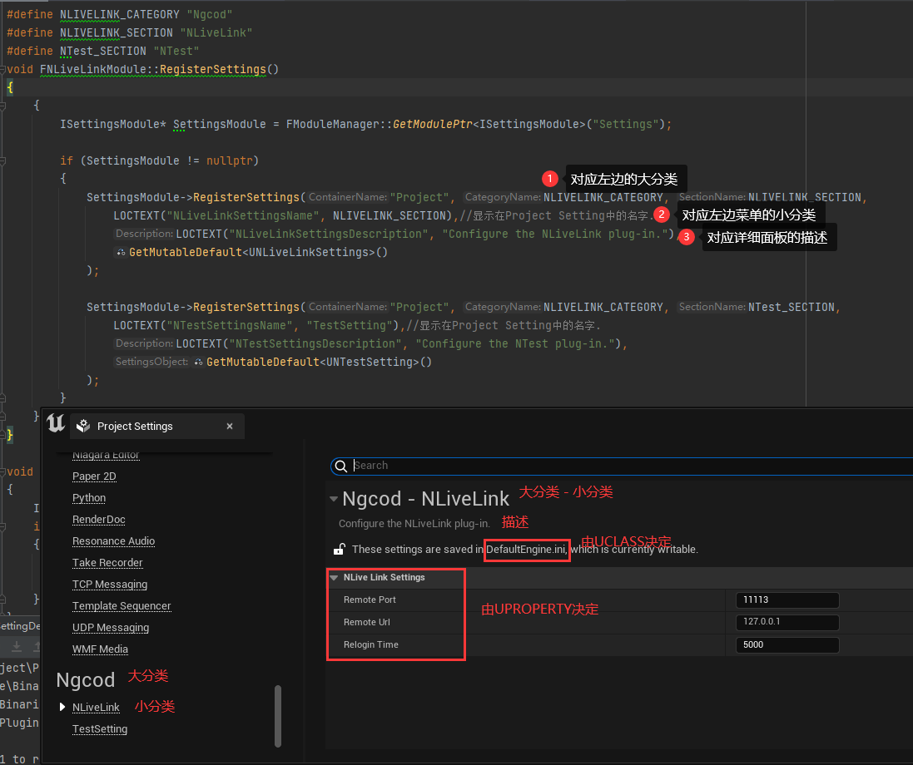

# 在插件中增加项目设置项

# 关于RegisterSettings参数
- 第一参数设置Project还是Editor。如果设置为Project，将出现在Project Setting中。如果设置为Editor，将出现在Editor Preferences中
- 第二参数,左边菜单大的分类Gategory，如原来的Project、Game、Plugins等
- 第三参数,设置Section也就是在ini文件中的前缀
- 第四参数,左边菜单中小的分类
- 第五参数,右边详细也中的描述
- 第六参数,设置Setting类具体的UObject，显示的设置项会根据UClass确定

# 关于详细信息的UClass
- UCLASS宏中可以指定Engine、Game来确定配置项出现在Engine.ini或是Game.ini中。详细页面也有一句提示“These setting are saved in DefaultGame.ini”
- UPROPERTY通过Category指定该配置将出现的分类
- UPROPERTY通过meta=(ToolTips="xxx")指定悬浮提示信息

# 如何读取配置信息
- int32 LiveLinkPort = 11113;
- GConfig->GetInt(TEXT("/Script/NLiveLink.NLiveLinkSettings"), TEXT("RemotePort"), LiveLinkPort, GEngineIni);
- "/Script/NLiveLink.NLiveLinkSettings"中NLiveLink为注册时的第三个参数
- "/Script/NLiveLink.NLiveLinkSettings"中NLiveLinkSettings为注册时的第六个参数UCLASS的名称

# Register & Unregister
- 通过SettingsModule->RegisterSettings和UnregisterSettings注册及取消
- 通过FModuleManager::GetModulePtr<ISettingsModule>("Settings")获取到SettingsModule
- 注册和取消注册参数要一致。（Category和Section）
- 可以在FCoreDelegates::OnPreExit和FCoreDelegates::OnPostEngineInit委托中注册和取消注册